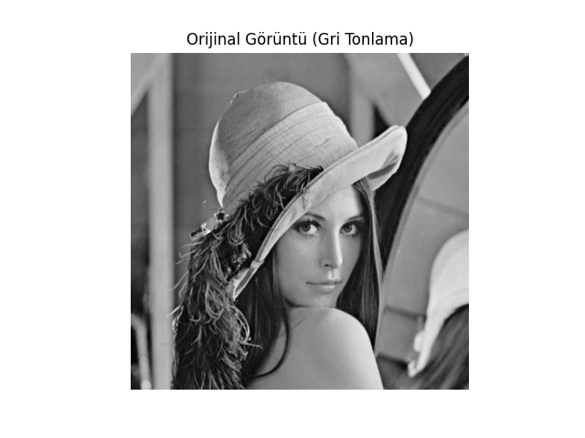
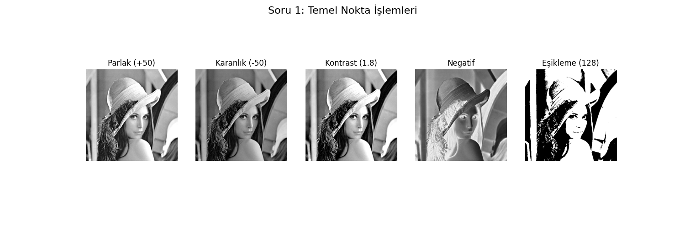
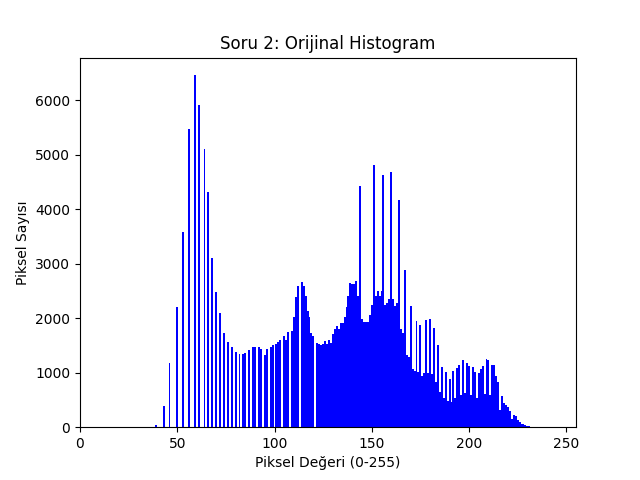
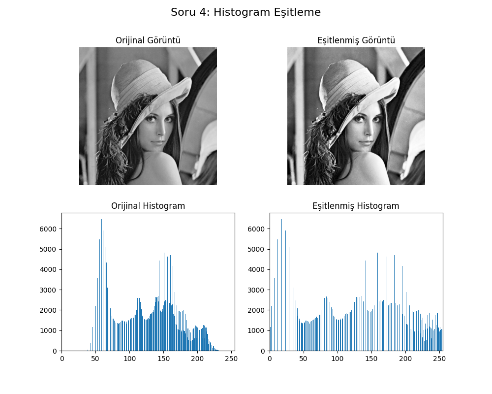
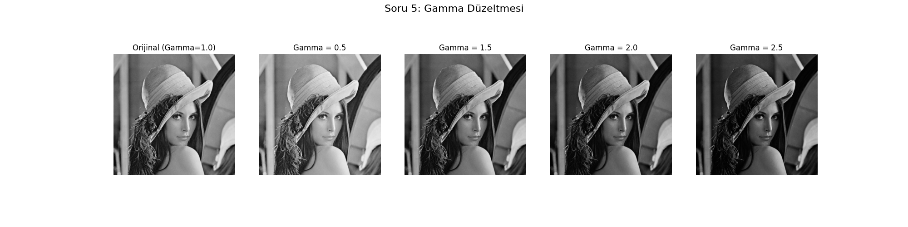

# 📸 Nokta İşlemleri ve Histogram

 Proje, temel görüntü işleme algoritmalarını `cv2.calcHist()` ve `cv2.equalizeHist()` gibi hazır kütüphane fonksiyonları kullanmadan, sıfırdan **NumPy** kütüphanesi ile implemente etmeye odaklanmaktadır.


---

## 🎯 Uygulanan Teknikler ve Rapor Görünümü

Bu projede 5 ana görüntü işleme tekniği kodlanmış ve sonuçları aşağıda "rapor" formatında sunulmuştur.

### 1. Orijinal Görüntü
Tüm işlemler, "Lena" test görüntüsünün 512x512 piksel gri tonlamalı versiyonu üzerinde gerçekleştirilmiştir.



### 2. Temel Nokta İşlemleri
Parlaklık, kontrast, negatif alma ve eşikleme işlemleri uygulanmıştır. Tüm taşma (overflow) kontrolleri `np.clip` ile sağlanmıştır.



### 3. Histogram Analizi
Görüntünün histogramı `np.bincount` ile manuel olarak hesaplanmıştır.
* **Ortalama:** 132.43
* **Standart Sapma:** 44.90
* **Entropi:** 6.97



### 4. Kontrast Germe (Contrast Stretching)
`output = ((input - min) / (max - min)) * 255` formülü sıfırdan uygulanarak görüntünün dinamik aralığı genişletilmiştir.


### 5. Histogram Eşitleme (Histogram Equalization)
Histogram eşitleme algoritması, Kümülatif Dağılım Fonksiyonu (CDF) `hist.cumsum()` kullanılarak **manuel** olarak implemente edilmiştir.



### 6. Gamma Düzeltmesi
`output = 255 * (input / 255)^gamma` formülü, ödevde istenen (0.5, 1.5, 2.0, 2.5) gamma değerleri için uygulanmıştır.



---

## 🚀 Kurulum ve Çalıştırma

1.  Gerekli kütüphanelerin yüklü olduğundan emin olun:
    ```bash
    pip install numpy matplotlib opencv-python pillow
    ```
2.  `test_goruntu.png` dosyasının kod ile aynı klasörde olduğundan emin olun.
3.  Aşağıdaki komut ile script'i çalıştırın:
    ```bash
    python odev3.py
    ```
4.  Script, tüm görsel çıktıları `Cikti_*.png` olarak klasörün içine kaydedecektir.

---

## 👤 Proje Sahibi
Yapay Zeka Mühendisliği Öğrencisi 

* **Gülnaz Aydemir**
* Ostim Teknik Üniversitesi
